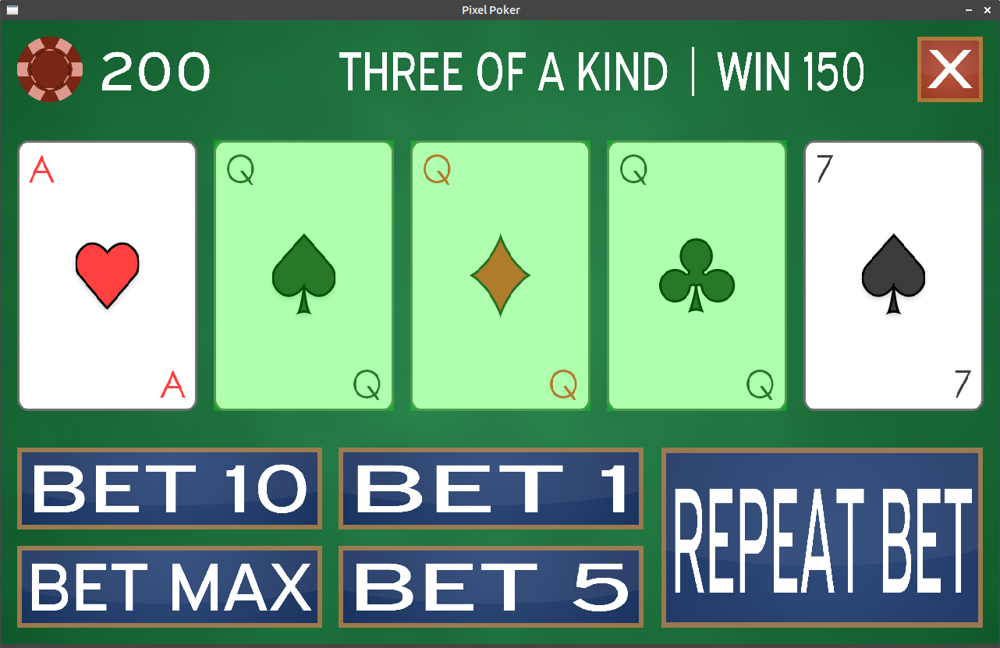

# Pixel Poker

## Build Dependencies
1. CMake
2. [GoogleTest](https://github.com/google/googletest)
3. SDL2
4. SDL2_image
5. SDL2_ttf
6. SDL2_mixer

On Debian/Ubuntu: `apt-get install cmake libsdl2-dev libsdl2-image-dev libsdl2-ttf-dev libsdl2-mixer-dev`

## Wishlist
 - Shuffle and dealing animations
 - Android version
 - Game controller support
 - Asset packs

## Bugs
 - There are plenty

## Thoughts - May 22, 2020

### Overview
This is the first game I've built in a long time. It's also the first time I've use SDL2 for anything more than simple graphical demos. My goal with writing this was to create a fully playable "feature-complete" game in a few days and I've accomplished that.

### YAGNI and Over-Engineering

This code is basically just a playground for me to work out some game design patterns. It's both incredibly over-complicated and under-developed at the same time. A simple poker game does not need a generic UI system with support for event handlers, but it allowed to me to learn some lessons about this style of design that should be helpful for more complex games.

At the other extreme, I attempted to build a scene system to collect all of the UI elements and behavior, but ended up just defining the whole UI in the Init() code. This worked fine for this game only because it has less than a dozen UI elements, but I would like to expand on the Scene idea in the future. I think it will be more useful in games with multiple menus and game states rather than just a static layout throughout the entire game.

### Memory Leaks and Error Handling

Another lesson that applies to all coding is to avoid skipping the "hard" stuff, e.g. "I'll come back and add error handling later." No you won't. And it will be harder to do the longer you delay. Don't be lazy. Check the returns on API and system calls and at least print a message if they fail. If nothing else, this gives a place to put a breakpoint and it's less work to go back and add cleanup or retry logic later.

The same goes for memory management. Writing the free() at the same time as the malloc() seems like a good idea. This game has no memory management. I only got away with that because there's a fixed amount of assets that can ever be created.

### Game N+1

There are a few key lessons I want to take with me to the next game:

1. Write at least a rough list of features up front and stick to it. Games development seems especially susceptible to feature-creep. There are a ton of cool features, but a finished game is also pretty cool.
2. Having a storyboard or UI mockup forces you to think through the user input and the interactions between game elements before getting too far down a design rabbit hole. In this case, having a generic UI system was not necessary and I could have saved a lot of time if I had planned out the structure in advance.
3. Keep the code simple and fast. Don't write a class when a struct will do. Don't build an interface for a single implementation. Abstract it later if necessary.
4. Refactor gradually and not all at once. I had the basic gameplay working in about 8 hours, but I spent another 20+ hours refactoring and rewriting things without a clear reason. Try to refactor only when the existing code base is inadequate for the next feature and not just because the code would be "cleaner".
5. Finally, have fun. Building games and playing games is a ton of fun. There is something uniquely satisfying about the first time you find yourself enjoying playing your new game.